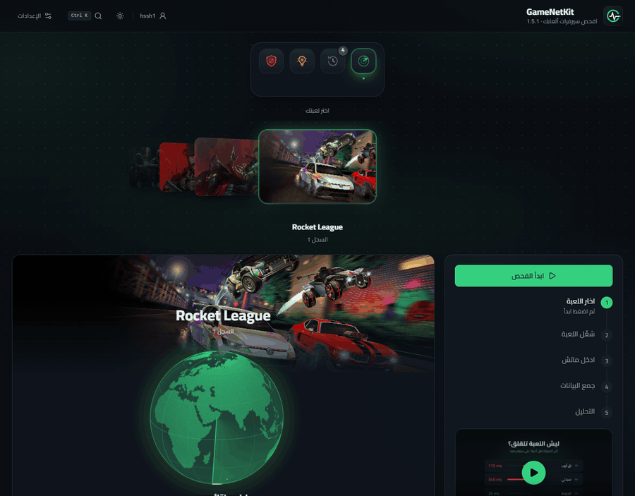
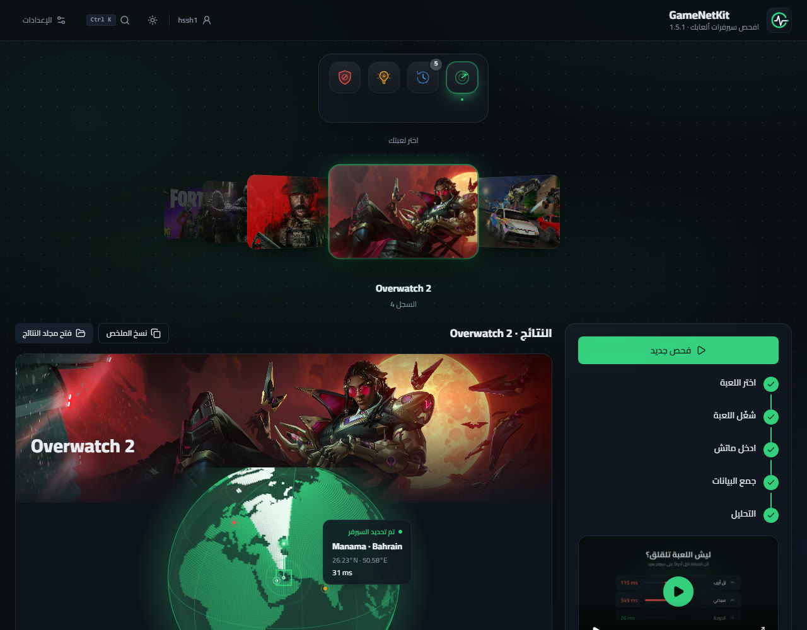
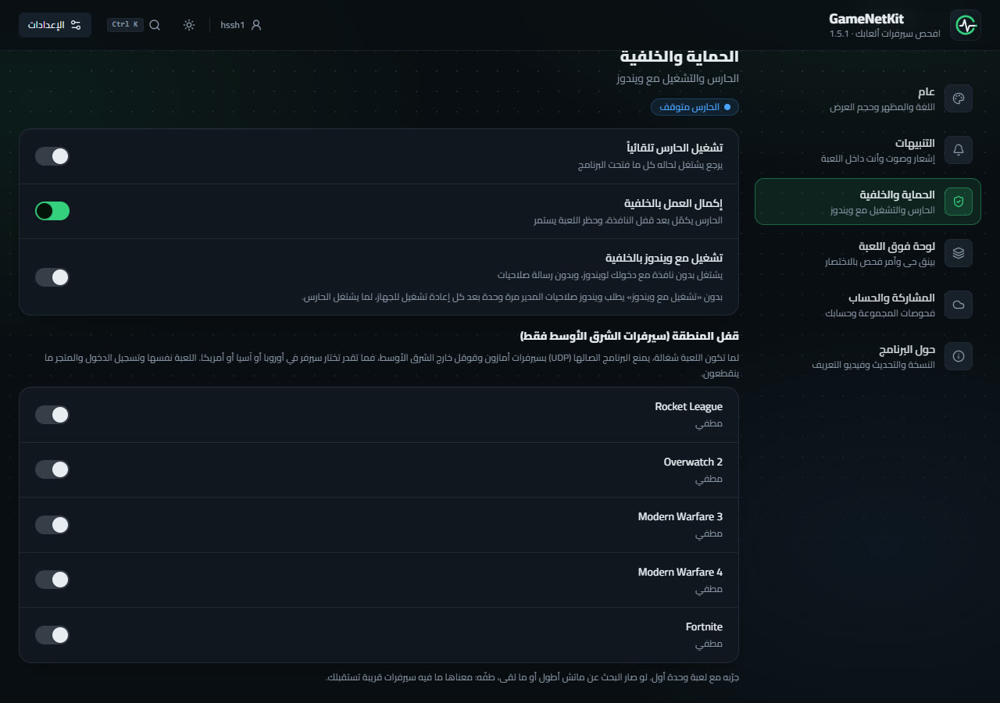
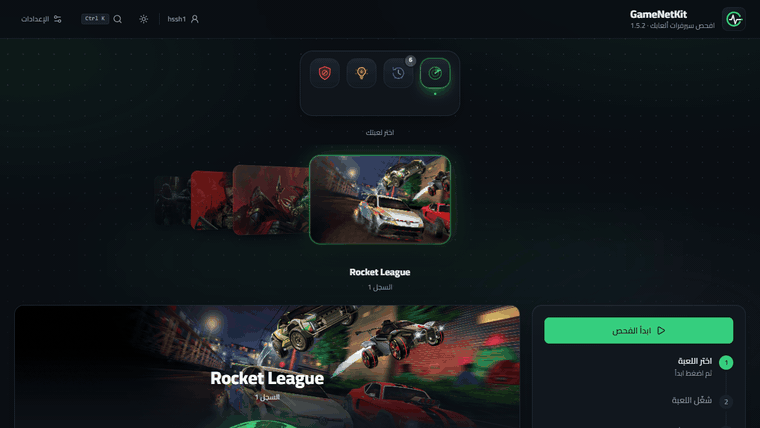
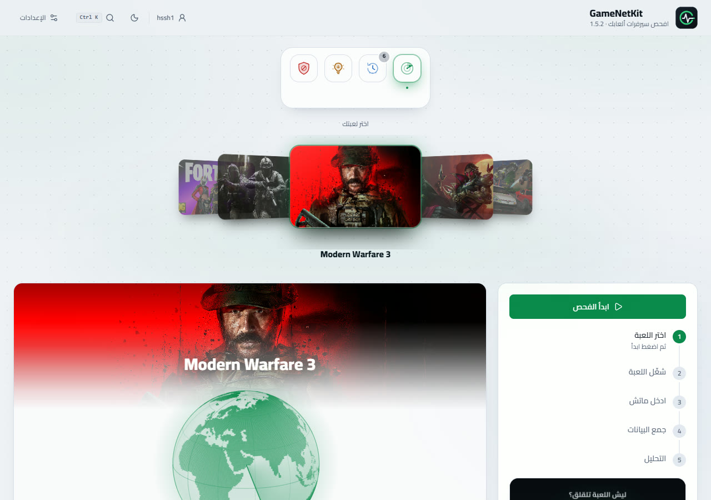

<div align="center">

<a href="../../releases/latest"></a>

<br>

[](../../releases/latest) [](../../releases) [](../../releases/latest) [](../../actions)

<br>

<a href="../../releases/latest"></a>

<sub>[English](README.md) · [العربية](README.ar.md)</sub>

</div>

---

<div dir="rtl">

## وش هو GameNetKit؟

برنامج صغير للويندوز **يكشف السيرفر اللي لعبتك متصلة فيه فعلاً** ويقول لك الصدق عنه: وين مكانه على الخريطة، وكم البنق والتذبذب وفقدان الحزم. وإذا السيرفر سيّئ، تقدر تحظره عشان اللعبة تدوّر على غيره.

</div>

<div align="center">

</div>

<div dir="rtl">

## ليش تحتاجه

- **تشوف سيرفر الماتش.** تبدأ الفحص وتلعب ماتش، والبرنامج يعطيك العنوان اللي كنت عليه، والدولة والمدينة، مع البنق والتذبذب والفقدان. وكرة أرضية تقفل على المكان بالضبط.
- **توقف السيّئ منها.** حظر سيرفر أو نطاق كامل بضغطة (قاعدة في جدار حماية ويندوز لـUDP فقط)، أو خلّ الحارس يسويها وقت تشغيل اللعبة بس.
- **تخلي اللعبة على السيرفرات القريبة.** «قفل المنطقة» يمنع اتصال اللعبة بسيرفرات أمازون وقوقل خارج الشرق الأوسط وهي شغّالة. مطفي افتراضياً، ولكل لعبة وحدها.
- **تتعلم من سجلك.** كل فحص ينحفظ لكل لعبة، مع إحصائيات لكل نطاق سيرفرات، واقتراحات بالنطاقات اللي تستاهل الحظر. وتقدر تشارك فحوصاتك مع ربعك لتجمعون الأدلة.
- **بنق مباشر فوق اللعبة.** لوحة صغيرة داخل اللعبة (`Ctrl + Alt + P`) فيها بنقك، وأمر تبدأ فيه الفحص بدون ما تطلع من اللعبة.
- **مريح للعين.** داكن وفاتح، عربي وإنجليزي، و`Ctrl + K` للأوامر السريعة، ونافذة خاصة فيه بدل تبويب متصفح.

</div>

## لقطات

<table>
<tr>
<td width="50%"><br><sub><b>النتيجة:</b> الكرة تقفل على سيرفر الماتش، وبعدها كل سيرفر شافه.</sub></td>
<td width="50%"><br><sub><b>الحماية:</b> الحارس والتشغيل مع ويندوز وقفل المنطقة لكل لعبة.</sub></td>
</tr>
<tr>
<td width="50%"><br><sub><b>Ctrl + K:</b> ابدأ فحص، اختر لعبة، انتقل لصفحة أو غيّر المظهر بدون ماوس.</sub></td>
<td width="50%"><br><sub><b>فاتح أو داكن:</b> المظهرين عندك، واختر اللي يريحك.</sub></td>
</tr>
</table>

<div dir="rtl">

## كيف تستخدمه

1. نزّل **`GameNetKit.exe`** من [الإصدارات](../../releases/latest). ملف واحد وما يحتاج تثبيت.
2. افتحه، واختر لعبتك، واضغط **ابدأ الفحص**، ووافق على نافذة صلاحيات المدير (مطلوبة لالتقاط ترويسات الحزم عبر `pktmon`).
3. شغّل اللعبة وادخل ماتش حقيقي. البرنامج يكتشف بداية الماتش لحاله ويسمع كم دقيقة.
4. اقرأ النتيجة. السيرفر الأكثر ترافيك هو غالباً سيرفر الماتش.
5. ما عجبك؟ اضغط **حظر السيرفر**. وتضغط «إلغاء الحظر» ويرجع.

التحديث من داخل البرنامج: **الإعدادات ← حول البرنامج ← تحقق من التحديث**.

## الألعاب

Rocket League · Overwatch 2 · Call of Duty: Modern Warfare 3 و4 · Fortnite

لعبة ثانية؟ حط ملف `games.json` جنب الـexe:

</div>

```json
[
  { "name": "My Game", "process": "MyGame.exe", "enabled": true }
]
```

<div dir="rtl">

## الأمان، بكلام واضح

- البرنامج **يقرأ فقط**. يلتقط *ترويسات* حزم UDP بأداة ويندوز `pktmon`، ويسوي بنق للسيرفرات. ما يلمس اللعبة ولا ذاكرتها ولا ملفاتها.
- ما يحظر شي إلا لما **أنت** تضغط (أو تفعّل الحارس أو قفل المنطقة)، وكل شي يضيفه تقدر تشيله من تبويب **المحظور**.
- اللي يطلع من جهازك: عناوين السيرفرات تنرسل لـ[ip-api.com](https://ip-api.com) لمعرفة الدولة والمدينة، وفحص التحديث على GitHub، وتنزيل صورة كل لعبة مرة وحدة من صفحتها في المتجر. وإذا دخلت مجموعة، يُشارك اسمك ونتائج فحوصاتك (عنوان السيرفر، مكانه، البنق) وما يُرسل أي شي عن جهازك.
- النافذة صفحة محلية على `127.0.0.1` برمز سري مختلف في كل تشغيل.
- ما صدر شي من شركات الألعاب عن أدوات مثل هذي. هو بس يراقب الشبكة فالخطر قليل جداً، بس مو صفر.

## الدليل الكامل

شرح مفصّل لكل ميزة (الحظر، الحارس، المجموعة، الاقتراحات، أماكن الملفات): [docs/GUIDE.ar.md](docs/GUIDE.ar.md).

## البناء

يحتاج ويندوز وNode.js (مترجم C# يجي مع .NET Framework 4).

</div>

```powershell
.\build.ps1      # ينتج dist\GameNetKit.exe
```

<div dir="rtl">

رفع وسم مثل `v1.5.2` يبني الإصدار وينشره لحاله (GitHub Actions).

## شكر

الواجهة مبنية بـReact وTailwind وMotion. مكونات مأخوذة ومعدّلة من [21st.dev](https://21st.dev): Server Card لـMohammad Shehadeh / Hirael (MIT)، وStatus لـdiceui، وVertical Stepper لـsean0205. صور الألعاب لأصحابها وتظهر داخل البرنامج على جهازك فقط.

</div>
