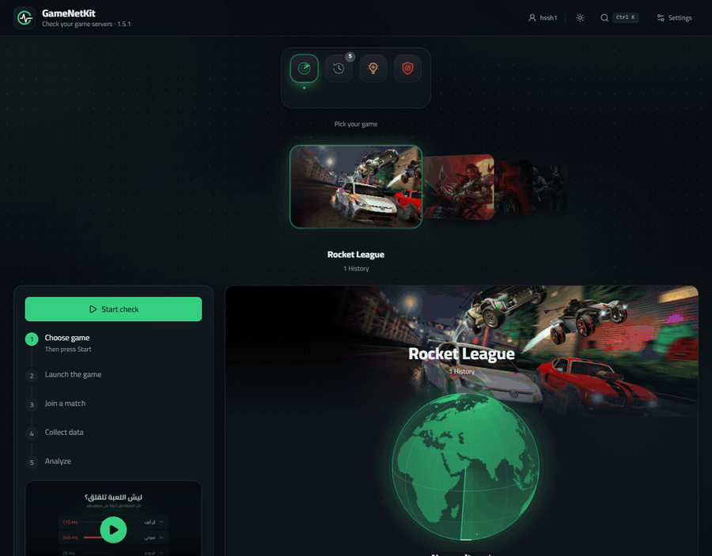
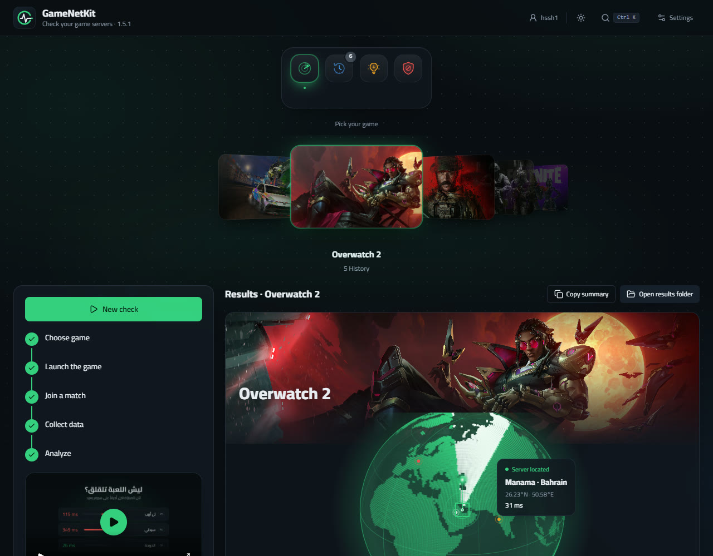
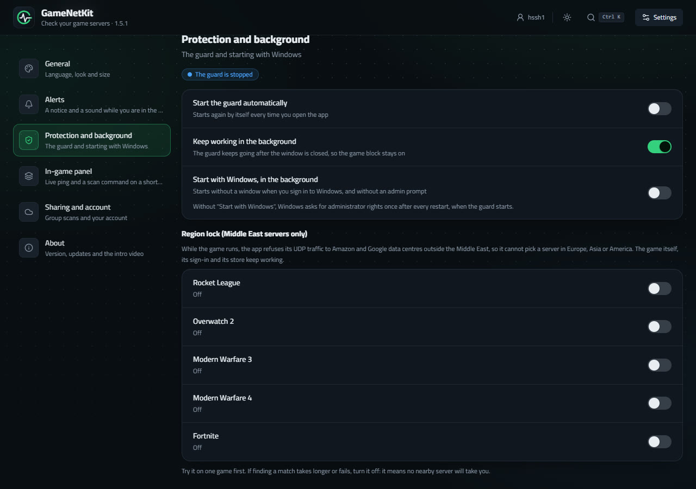
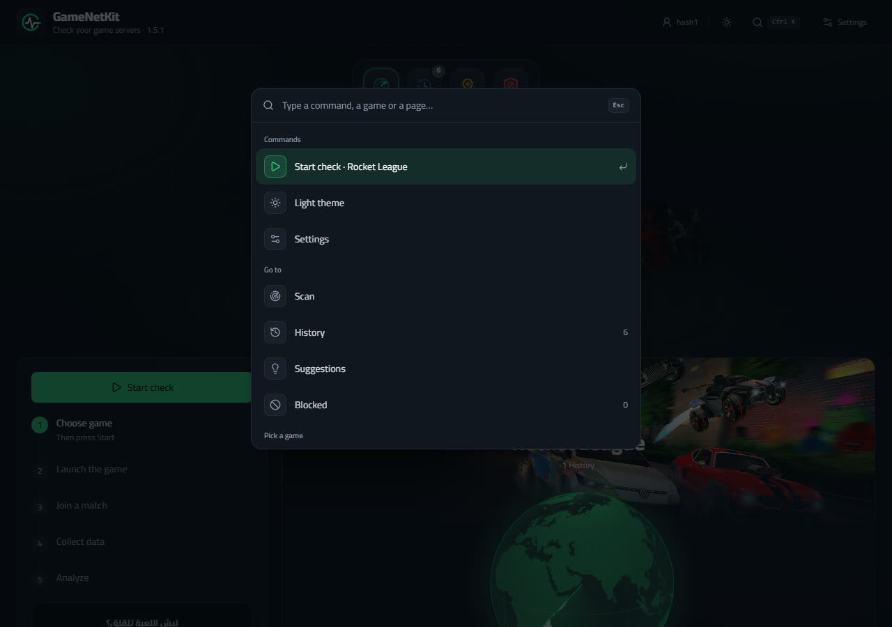

<div align="center">

<a href="../../releases/latest"></a>

<br>

[](../../releases/latest) [](../../releases) [](../../releases/latest) [](../../actions)

<br>

<a href="../../releases/latest"></a>

<sub>[English](README.md) · [العربية](README.ar.md)</sub>

</div>

---

## What is GameNetKit?

A small Windows app that **finds the server your game is really connected to** and tells you the truth about it: where it is on the map, and what your ping, jitter and packet loss are. When a server is bad, you can block it, so the game looks for another one.

<div align="center">

</div>

## Why you may want it

- **See the match server.** Start a scan, play a match, and the app tells you which address you were on, in which country and city, with ping, jitter and loss. A globe locks on to the exact place.
- **Stop the bad ones.** Block a server or a whole range with one click (a Windows Firewall rule for UDP only), or let the guard do it for you only while the game is running.
- **Keep a game to nearby servers.** *Region lock* refuses a game's traffic to Amazon and Google data centres outside the Middle East while it runs. Off by default, per game.
- **Learn from your history.** Every scan is saved per game, with stats per server range and suggestions on what is worth blocking. Optionally share scans with friends and pool the evidence.
- **Live ping over the game.** A small in-game panel (`Ctrl + Alt + P`) with your ping, and a command to start a scan without leaving the game.
- **Built to be pleasant.** Dark and light, Arabic and English, `Ctrl + K` for quick commands, and your own window instead of a browser tab.

## Look inside

<table>
<tr>
<td width="50%"><br><sub><b>The result:</b> the globe locks on the match server, then every server it saw.</sub></td>
<td width="50%"><br><sub><b>Protection:</b> the guard, start with Windows, and the region lock per game.</sub></td>
</tr>
<tr>
<td colspan="2"><br><sub><b>Ctrl + K:</b> start a scan, pick a game, jump to a page or switch the look without touching the mouse.</sub></td>
</tr>
</table>

## How to use it

1. Download **`GameNetKit.exe`** from [Releases](../../releases/latest). One file, nothing to install.
2. Open it, pick your game, press **Start check** and approve the Windows admin prompt (needed to capture packet headers with `pktmon`).
3. Launch the game and join a real match. The app notices the match by itself and listens for a few minutes.
4. Read the result. The server with the most traffic is almost always your match server.
5. Don't like it? Press **Block server**. Press it again to undo.

The app updates itself from GitHub Releases when you ask it to (**Settings → About → Check for updates**).

## Games

Rocket League · Overwatch 2 · Call of Duty: Modern Warfare 3 and 4 · Fortnite

Another game? Put a `games.json` next to the exe:

```json
[
  { "name": "My Game", "process": "MyGame.exe", "enabled": true }
]
```

## Safety, in plain words

- It **only reads**. It captures UDP packet *headers* with Windows' own `pktmon`, and pings the servers. It never touches the game, its memory or its files.
- It blocks nothing until **you** press the button (or switch the guard or region lock on), and everything it adds can be removed from the **Blocked** tab.
- What leaves your PC: server addresses sent to [ip-api.com](https://ip-api.com) to find their country and city, the update check on GitHub, and a one-time download of each game's picture from its store page. If you join a group, your name and scan results (server address, place, ping) are shared with it, never anything about your PC.
- The window is a local page on `127.0.0.1` with a secret token per run.
- No game publisher has said anything about tools like this. It only watches the network, so the risk is very low, but it is not zero.

## Build it yourself

Needs Windows and Node.js (the C# compiler comes with .NET Framework 4).

```powershell
.\build.ps1      # produces dist\GameNetKit.exe
```

Pushing a tag like `v1.5.2` builds and publishes the release by itself (GitHub Actions). More in Arabic: [docs/GUIDE.ar.md](docs/GUIDE.ar.md).

## Credits

UI built with React, Tailwind and Motion. Components adapted from [21st.dev](https://21st.dev): Server Card by Mohammad Shehadeh / Hirael (MIT), Status by diceui, Vertical Stepper by sean0205. Game pictures belong to their owners and are shown only inside the app on your PC.
